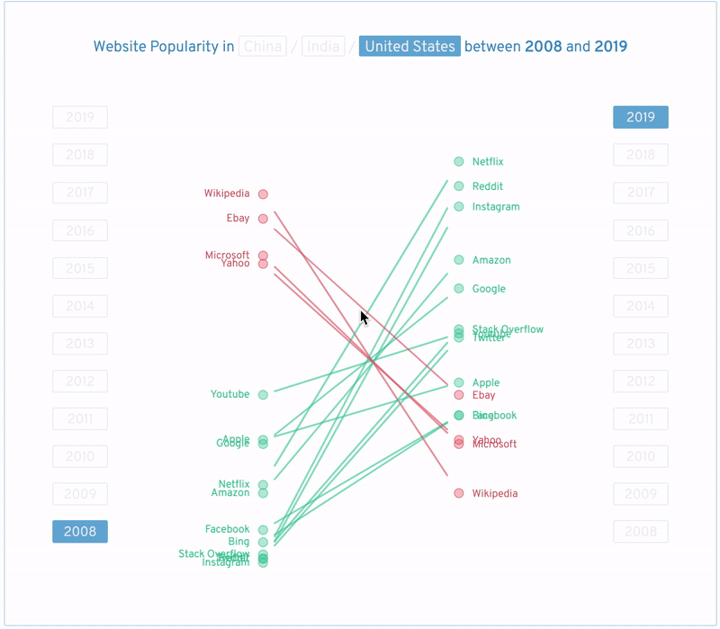
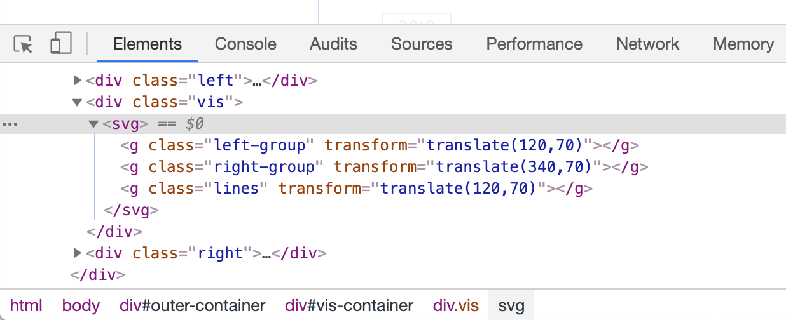
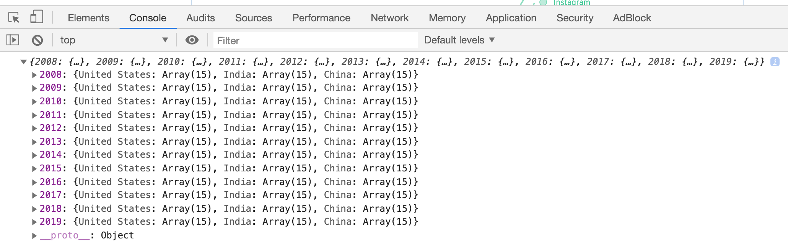
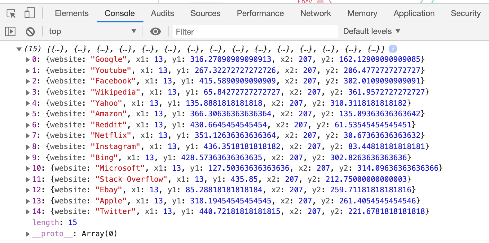

# HW 4: Animated Slope Graph

In this assignment, you will create an *animated slope graph* that visualizes the popularity of 15 websites. The best example of an animated slope graph is probably [the Salary vs. Performance slope graph](https://fathom.info/salaryper/) for 30 Major League Baseball Teams created by Fathom. This assignment will guide you through creating something similar.

## Introduction

You will be working towards the following animated slope graph. You can select a country from the title to visualize the website popularity in the selected country. When you select a year from the left, the left axis will be updated to show the website popularity for that year. The right axis will similarly be updated when you select a year from the right.



From the visualization, we can see the websites that decreased in popularity (color-coded in red) and those that increased in popularity (color-coded in green) between two years. For example, we can see from below that Yahoo and Ebay have become less popular in the US between 2008 and 2019 while Netflix, Reddit and Instagram have been more popular in the same period.


## Data

You will use the website popularity data at `/data/data.csv` to create the animated slope graph. The data is scraped from [Google Trends](https://trends.google.com/trends/). Here is a snippet of the dataset:

|   `region`    | `website` |`year`|`popularity`|
|---------------|-----------|------|------------|
| United States |   Google  | 2008 |     29     |
| United States |   Google  | 2009 |     36     |
| United States |   Google  | 2010 |     44     |
|     India     |   Google  | 2008 |     51     |
|     India     |   Google  | 2009 |     56     |
|     India     |   Google  | 2010 |     59     |
|     China     |   Google  | 2008 |     15     |
|     China     |   Google  | 2009 |     15     |
|     China     |   Google  | 2010 |     21     |

* `region` (`string`) - the name of a region (United States, India, and China)
* `website` (`string`) - the name of a website
* `year` (`number`) - the year for that recording
* `popularity` (`number`) - popularity value from [Google Trends](https://trends.google.com/trends/)

## Helper Functions

You are required to use the starter code in this repository for the assignment. You task is to implement five functions in `main.js`. These functions are `getYScale(data)`, `nestData(data)`, `drawLeftCirclesAndLabels()`, `drawRightCirclesAndLabels()`, and `drawLines()`. We have implemented some functions to help you. Before learning about the five functions you will implement, let's look at the helper functions.

1. `getSelectedRegion()`

Returns the currently selected region (United States, India, or China).

2. `getSelectedLeftYear()`

Returns the currently selected year for the left axis.

3. `getSelectedRightYear()`

Returns the currently selected year for the right axis.

4. `getLineData()`

Return the data for implementing `drawLines`. `getLineData()` relies on the correct implementation of `getYScale` to work properly.

5. `getColor(website)`

Return the color for the corresponding `website`. It returns green (red) if the website gets a higher (lower) popularity score in the right axis than in the left axis. If the popularity scores of the website are similar in the left and right axes, it returns gray.

## Code Structure

In `main.js`, you can see the following code block for loading data.

```javascript

d3.csv('data/data.csv', dataProcessor).then(function(data) {
	yScale = getYScale(data);
	yearToRegionToData = nestData(data);

	initLeftCircleAndLabelGroup();
	initRightCircleAndLabelGroup();
	initLineGroup();

	drawLeftCirclesAndLabels();
	drawRightCirclesAndLabels();
	drawLines();
});

```

After the data are loaded, it creates a y scale using `getYScale(data)` and processes the data using `nestData(data)`. Additionally, it creates an SVG group for the left circles and labels using `initLeftCircleAndLabelGroup()`, a group for the right circles and labels using `initRightCircleAndLabelGroup()`, and a group for the lines using `initLineGroup()`. 

If you inspect the elements using the Web Inspector, you will see three groups that have the class names `left-group`, `right-group`, and `lines` (see the following figure). In `main.js`, these groups are stored in `leftCircleAndLabelGroup`, `rightCircleAndLabelGroup`, and `lineGroup` respectively.

<kbd>

</kbd>
<br/><br/>

`drawLeftCirclesAndLabels()` will render the left circles and labels in the group named `left-group`; `drawRightCirclesAndLabels()` will render the right circles and labels in the group named `right-group`; And `drawLines()` will render the lines in the group named `lines`.

## What to Implement

With the above helper functions, you will implement five functions in `main.js`:`getYScale(data)`, `nestData(data)`, `drawLeftCirclesAndLabels()`, `drawRightCirclesAndLabels()`, and `drawLines()`. Each function carries 2 points. If you succesfully implement all functions, you will earn 10 points in total.

To get started, you could implement the functions in the same order as they are presented below. To simplify things, you might try working on a smaller problem, for example, just focusing on the United States and two years. It's not too difficult to generalize to the full data set from that point then.

1. `getYScale(data)` (2 points)

Find the min and max popularity value from `data`. Create a linear scale with the a domain `[ minPopularity, maxPopularity ]` and a range `[ svgHeight - margin.top - margin.bottom, 0 ]`. Return the created scale.

2. `nestData(data)` (2 points)

Recall that in [Lab 4](https://github.gatech.edu/CS-7450/Fall-2019-Labs/wiki/Lab-4:-D3-Selections-and-Grouping) we have learnt about nesting. For `nestData(data)`, you will use `d3.nest()` to group `data`. You need to nest the data twice, using `year` and then using `region`. Your code for nesting should look something like:

```javascript

var nestedData = d3.nest()
	.key(...)
	.key(...)
	.object(...);

```

`.key(...)` is applied twice because we want to nest the data twice. Don't forget to return the nested data. **Note that you must use d3.nest() to get full credits.** If your implementation is correct, you will see the following when you console log `yearToRegionToData`.

<kbd>

</kbd>
<br/><br/>
  
3. `drawLeftCirclesAndLabels()` (2 points)

Draw the circles and labels on the left to `leftCircleAndLabelGroup` (it stores the group with the class name `left-group`). Here are a few hints and tips:

* You can get the selected year for the left axis using `var selectedYear = getSelectedLeftYear();`.
* You can get the selected region using `var selectedRegion = getSelectedRegion();`.
* If your implementation for `nestData(data)` is correct, you can get the data for creating the left circles and labels using `var selectedData = yearToRegionToData[selectedYear][selectedRegion];`
* **To get full credits, you must animate the circles and labels using `.transition()`.** 
* **To get full credits, you must use the d3 Enter, Update, and Exit pattern to create the circles and labels.** 
* **You are also required to use object constancy per `website` to get full credits.** This implies that there should be a line which looks like `.data(selectedData, function(d) { return d.website; });`. If you did not consider object constancy, your animation will look a bit weird. Revisit [Lab 5](https://github.gatech.edu/CS-7450/Fall-2019-Labs/wiki/Lab-5:-D3-Enter,-Update-and-Exit) to brush up on object constancy.
* The color of circles and text can be obtained from the helper function `getColor(website)`. The code for changing the colors of the circles and the labels will look like `.style('fill', function(d) { return getColor(d.website); })`.

4. `drawRightCirclesAndLabels()` (2 points)

Draw the circles and labels on the left to `rightCircleAndLabelGroup` (it stores the group with the class name `right-group`). The code should be extremely similar to that in `drawLeftCirclesAndLabels()`.

5. `drawLines()` (2 points)

If your implementation of `getYScale(data)` is correct, you will see the following when you console log `lineData`. Use `lineData` to draw the lines to `lineGroup`. Each object in `lineData` corresponds to a line for a website. 

<kbd>

</kbd>
<br/><br/>

Here are again a few tips:
* **To get full credits, you must animate the lines using `.transition()`.** 
* **To get full credits, you must use the d3 Enter, Update, and Exit pattern to create the lines.** 
* **Again, use object constancy per `website` to get full credits.** This implies that somewhere in the function, there should be a code block that looks like:

```javascript

var lineUpdate = lineGroup.selectAll('line')
	.data(lineData, function(d) { return d.website; });

```

* Use `x1`, `x2`, `y1`, and `y2` in `lineGroup` to render the lines. Here is the corresponding code block that will appear in the function.

```javascript

.attr('x1', function(d) { return d.x1; })
.attr('y1', function(d) { return d.y1; })
.attr('x2', function(d) { return d.x2; })
.attr('y2', function(d) { return d.y2; })

```

## Grading

This assignment will be graded out of a 10 point scale. Each of the above 5 functions carries two points. You will get one point for attempting to implement a function but only being able to get it partially working.

You will **not lose points** on any of the following:

1. The styling of your visualizations (e.g., styles and positions of the circles, and labels).
2. Conventions or legibility of your code.

However, to get full credits, you must do the following:

1. Use `d3.nest()` to implement `nestData(data)`
2. Animate the circles, labels, and lines using `.transition()`.
3. Use object constancy per `website` for the circles, labels, and lines
4. Use the d3 Enter, Update, and Exit pattern to create the circles, labels, and lines.

## Getting Help

Reminder that this is an individual assignment. The code you turn in must be your own creation. You cannot seek help from friends, classmates, the internet, etc.  You are welcome to seek help from the TAs, however.  (Just as a reminder, [here](https://www.cc.gatech.edu/~stasko/7450/ta.html) are their office hours.)  You can ask questions on [Piazza](https://piazza.com/class/jzrq38kpx0889) as well, but you shouldn't be posting segments of your code in the question.

## Submission

You will submit your code via Canvas. Compress your code into a zip file called `lastname_firstname_hw4.zip`.
